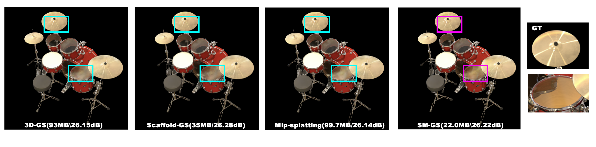

# SM-GS: Structured Anti-aliased 3D Gaussian Splatting

  

[Kanshan Liu](https://github.com/welshel)

  

## Overview

  

<p align="center">



</p>

  

**SM-GS** is a structured anti-aliased 3D Gaussian Splatting framework. It addresses the aliasing artifacts of 3DGS and the frequency control limitations of Scaffold-GS.

  

By integrating the **analytic filtering mechanism** of Mip-Splatting into the **neural anchor representation** of Scaffold-GS, our method achieves:

- **Scale-Consistent Rendering**: Robust anti-aliasing from 1x to 1/8x resolutions.

- **High Storage Efficiency**: ~17.9MB average model size (vs. 67MB+ for 3DGS/Mip-Splatting).

- **SOTA Quality**: Outperforms baselines on the Blender dataset (LPIPS 0.034).

  
  

## Installation

  

### Prerequisites

- **OS**: Validated on Linux (Ubuntu 24.04.3 LTS).

- **Windows Users**: We strongly recommend using **WSL2** (Windows Subsystem for Linux).If you want to know how to start with WSL2 , pls refer to Quick_Start.md

- **CUDA**: 11.8 (Recommended).

- **Compiler**: **GCC/G++ 11** (Tested with 11.5.0).

  > ⚠️ **Important**: Ubuntu 22.04/24.04 often defaults to GCC 12/13, which may be incompatible with CUDA 11.8. Please ensure you are using GCC 11 to avoid compilation errors in submodules.

  

### Steps

  

1. **Clone the repository**

```bash

   git clone [https://github.com/welshel/SM-GS.git](https://github.com/welshel/SM-GS.git) --recursive

   cd SM-GS

```
2. **Create the environment**

  
```bash

conda env create -f environment.yml

conda activate sm-gs

```

**Install Submodules This project relies on custom CUDA kernels. Please install them manually:**

  

```Bash
# Optional: If your default gcc is >11, force use gcc-11

# export CC=/usr/bin/gcc-11

# export CXX=/usr/bin/g++-11

# Install diff-gaussian-rasterization

pip install ./submodules/diff-gaussian-rasterization


# Install simple-knn

pip install ./submodules/simple-knn
```
> Note: Ensure your CUDA toolkit version matches your PyTorch CUDA version (check with nvcc --version).

## Training

### Training multiple scenes

To train multiple scenes in parallel, we provide batch training scripts: 

 - Tanks&Temples: ```train_tnt.sh```
 - MipNeRF360: ```train_mip360.sh```
 - BungeeNeRF: ```train_bungee.sh```
 - Deep Blending: ```train_db.sh```
 - Nerf Synthetic: base ->```train_nerfsynthetic.sh```; with warmup->```train_nerfsynthetic_withwarmup.sh```

 run them with 

 ```
bash train_xxx.sh
 ```

 > Notice 1: Make sure you have enough GPU cards and memories to run these scenes at the same time.

 > Notice 2: Each process occupies many cpu cores, which may slow down the training process. Set ```torch.set_num_threads(32)``` accordingly in the ```train.py``` to alleviate it.

### Training a single scene

For training a single scene, modify the path and configurations in ```single_train.sh``` accordingly and run it:

```
bash ./single_train.sh
```

- scene: scene name with a format of ```dataset_name/scene_name/``` or ```scene_name/```;
- exp_name: user-defined experiment name;
- gpu: specify the GPU id to run the code. '-1' denotes using the most idle GPU. 
- voxel_size: size for voxelizing the SfM points, smaller value denotes finer structure and higher overhead, '0' means using the median of each point's 1-NN distance as the voxel size.
- update_init_factor: initial resolution for growing new anchors. A larger one will start placing new anchor in a coarser resolution.

> For these public datasets, the configurations of 'voxel_size' and 'update_init_factor' can refer to the above batch training script. 


This script will store the log (with running-time code) into ```outputs/dataset_name/scene_name/exp_name/cur_time``` automatically.


## Evaluation

We've integrated the rendering and metrics calculation process into the training code. So, when completing training, the ```rendering results```, ```fps``` and ```quality metrics``` will be printed automatically. And the rendering results will be save in the log dir. Mind that the ```fps``` is roughly estimated by 

```
torch.cuda.synchronize();t_start=time.time()
rendering...
torch.cuda.synchronize();t_end=time.time()
```

which may differ somewhat from the original 3D-GS, but it does not affect the analysis.

Meanwhile, we keep the manual rendering function with a similar usage of the counterpart in [3D-GS](https://github.com/graphdeco-inria/gaussian-splatting), one can run it by 

```
python render.py -m <path to trained model> # Generate renderings
python metrics.py -m <path to trained model> # Compute error metrics on renderings
```

## Viewer

The [viewer](https://github.com/city-super/Scaffold-GS/tree/main/SIBR_viewers) for SM-GS is available now.(As our method is based on Scaffold-GS, the viewer is also available for SM-GS.)

Recommended dataset structure in the source path location:

```
<location>
|---sparse
    |---0
        |---cameras.bin
        |---images.bin
        |---points3D.bin
```

or

```
<location>
|---points3D.ply
|---transforms.json
```

Recommended checkpoint  structure in the model path location:

```
<location>
|---point_cloud
|   |---point_cloud.ply
|   |---color_mlp.pt
|   |---cov_mlp.pt
|   |---opacity_mlp.pt
(|   |---embedding_appearance.pt)
|---cfg_args
|---cameras.json
(|---input.ply)
```


## Contact

- Liu ZhiHong: liuzhweishan99@gmail.com
